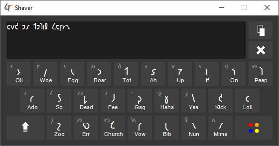

# Shaver
Pretty, minimalist Shavian on-screen keyboard for Windows.

## Purpose
The Shavian alphabet (or Shaw alphabet) is an alphabet designed to mirror English phonology as closely as possible. This makes it quite convenient as a way to write without any ambiguity in pronunciation, even going so far as to portray the author's accent as part of the written text.

If you're interested in learning more [you can find the Wikipedia article here](https://en.wikipedia.org/wiki/Shavian_alphabet).

## Motivation
Currently, though Shavian [is supported in Unicode](https://en.wikipedia.org/wiki/Shavian_alphabet#Unicode) as of version 4.0 (April 2003) font support has been very lacking. This keyboard uses [Adagii](http://www.i18nguy.com/unicode/unicode-font.html) as a font but [there are others available](https://en.wikipedia.org/wiki/Shavian_alphabet#Fonts).

## Building
You'll need Visual Studio 2015 installed to build the executable. Just build it like any other C# WinForms solution.

## Use
Shaver doesn't support typing directly into a text field. This is a conscious decision taken due to the currently dire lack of rendering support for the Shavian character set. You can type in the Shaver window using the mouse or keyboard. The shift key will work to switch over the active character set, as will clicking on the on-screen shift key.
